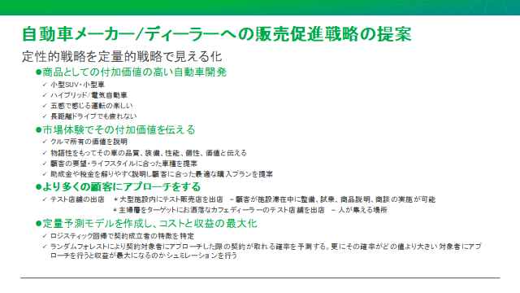

# Proposal-for-automobile-sales-promotion
### 統計手法と機械学習を用いた自動車 メーカーの自動車販売促進とシェアリングビジネス拡大の提案

### 概要

### 23区と郊外の自動車保有台数の差に対してT検定をおこなう

### 続いて自動車保有台数を目的変数、その他の説明変数を用いて重回帰分析を実行

### 最後に自然言語処理の共起ネットワークでツイッター・他のSNS・Webニュースから投稿を分析
    共起ネットワークによる分析を何回か繰り返す

### 分析から導き出された特徴をサマライズする

### 戦略の提案

### シェアリング市場に関しては、共起ネットワーク分析のみを行った
　　ここでも共起ネットワークによる分析を何回か繰り返す

### 分析から導き出された特徴をサマライズする

### 戦略の提案

### 自動車市場将来モデル

